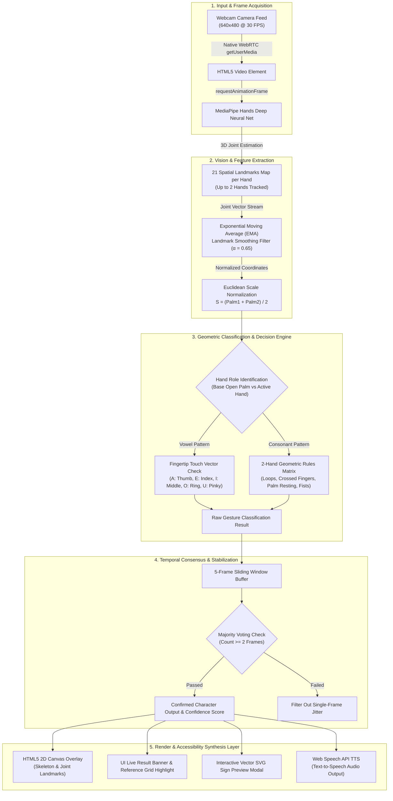

# BANZSL / Sri Lankan Sign Language (A–Z) Architecture Pipeline

A professional end-to-end architectural breakdown and technical data flow specification for the **Real-Time BANZSL / Sri Lankan Sign Language (A–Z) to Text Converter**.

---

## 1. End-to-End System Architecture Flow



---

## 2. Pipeline Stage Technical Breakdown

| Stage | Stage Name | Technologies | Mathematical / Technical Function | Latency |
| :--- | :--- | :--- | :--- | :--- |
| **Stage 1** | **Frame Acquisition** | HTML5 WebRTC `getUserMedia`, `<video>` | Captures raw YUV video frames at 640x480 resolution at 30 FPS. | ~2 ms |
| **Stage 2** | **Hand Joint Extraction** | MediaPipe Hands ML SDK | Predicts 21 3D spatial joint coordinates $(x, y, z)$ per detected hand. | ~15 ms |
| **Stage 3** | **Temporal Landmark Smoothing** | Exponential Moving Average (EMA) | Eliminates joint jitter across frames: $\hat{P}_t = \alpha P_t + (1-\alpha)\hat{P}_{t-1}$ | <1 ms |
| **Stage 4** | **Euclidean Scale Normalization** | Vector Math Engine | Calculates average palm length $S$ to make rules invariant to camera distance. | <1 ms |
| **Stage 5** | **Geometric BANZSL Classifier** | Rule-Based Decision Tree | Tests fingertip touches, circles, interlocks, and palm contact geometries for A–Z. | ~1 ms |
| **Stage 6** | **Temporal Stabilization** | 5-Frame Sliding Window | Confirms gesture only when supported by majority consensus across recent frames. | <1 ms |
| **Stage 7** | **Visual Canvas Rendering** | HTML5 2D Canvas Context | Overlays Royal Blue skeleton lines and Green joint dots over camera feed. | ~3 ms |
| **Stage 8** | **Speech & Text Synthesis** | Web Speech API (`SpeechSynthesis`) | Converts recognized text buffer into natural voice audio output. | Asynchronous |

---

## 3. Mathematical Foundations

### 1. 3D Euclidean Spatial Distance
The distance $D(P_1, P_2)$ between two hand joint landmarks $P_1(x_1, y_1, z_1)$ and $P_2(x_2, y_2, z_2)$ is defined as:

$$\text{dist}(P_1, P_2) = \sqrt{(x_1 - x_2)^2 + (y_1 - y_2)^2 + (z_1 - z_2)^2}$$

### 2. Distance Invariance Scale Factor
To make gesture recognition distance-independent (whether the user stands near or far from the webcam), the hand scale $S$ is calculated from palm lengths:

$$S = \frac{\text{dist}(\text{Wrist}_1, \text{MiddleMCP}_1) + \text{dist}(\text{Wrist}_2, \text{MiddleMCP}_2)}{2}$$

All spatial distances between hand landmarks are normalized by dividing by $S$:

$$d_{\text{normalized}} = \frac{\text{dist}(P_i, P_j)}{S}$$

### 3. Exponential Moving Average (EMA) Landmark Smoothing
To prevent hand landmark jitter caused by camera noise or shadows, landmark coordinates are smoothed across video frames:

$$\hat{P}_t = \alpha \cdot P_t + (1 - \alpha) \cdot \hat{P}_{t-1} \quad \text{where } \alpha = 0.65$$

### 4. Temporal Majority Voting Consensus
To filter out transient false positives and flicker:

$$C_t = \text{mode}\Big(\{ R_{t-4}, R_{t-3}, R_{t-2}, R_{t-1}, R_t \}\Big)$$

The character $C_t$ is rendered to UI if $\text{count}(C_t) \ge 2$.

---

## 4. Classification Geometry Rules Summary (A–Z)

```
Vowels (A, E, I, O, U):
- Active Index Finger -> Open Hand Thumb Tip  => 'A' (d < 0.48 * S)
- Active Index Finger -> Open Hand Index Tip  => 'E' (d < 0.48 * S)
- Active Index Finger -> Open Hand Middle Tip => 'I' (d < 0.48 * S)
- Active Index Finger -> Open Hand Ring Tip   => 'O' (d < 0.48 * S)
- Active Index Finger -> Open Hand Pinky Tip  => 'U' (d < 0.48 * S)

Loops & Circles:
- Joined Thumb-Index Circles (Both Hands) => 'B'
- Thumb-Index Circle + Extended Index     => 'P'
- Hooked Index inside Opposite Circle     => 'Q'

Geometries & Palm Touches:
- 3 Fingers (Index, Mid, Ring) on Palm    => 'M'
- 2 Fingers (Index, Mid) on Palm         => 'N'
- Hooked Index on Open Palm              => 'R'
- Perpendicular Index across Open Palm   => 'L'
- Flat Palm resting/swiping on Open Palm => 'H'
- Crossed Index & Middle (2x2 Grid)       => 'F'
- Crossed Index Fingers (X Shape)        => 'X'
- Stacked Closed Fists                   => 'G'
- Hooked Pinky Fingers                   => 'S'
- Interlocked Fingers (W Zigzag)         => 'W'
- Side-by-Side Flat Palms                => 'Z'
```

---

## 5. Technology Stack Summary

- **Vision Pipeline**: MediaPipe Hands JS Engine (`@mediapipe/hands`, `@mediapipe/camera_utils`)
- **Frontend App**: Vanilla JavaScript (ES6+), HTML5 Canvas, CSS3 (Royal Blue & Green Edition)
- **Audio & Accessibility**: Web Speech API (`SpeechSynthesisUtterance`)
- **Backend Application**: Python 3.x, Flask Framework
